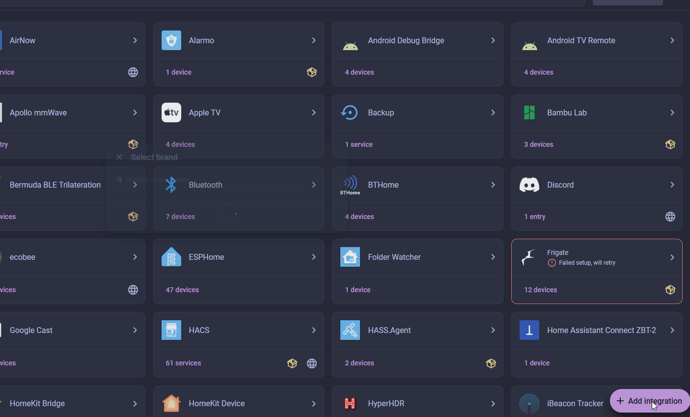

[![GitHub Release][releases-shield]][releases]
[![GitHub Activity][commits-shield]][commits]
![Install Stats][stats]

![Project Maintenance][maintenance-shield]
[![Community Forum][forum-shield]][forum]

# Kleenex pollen radar / Scottex

This is a custom integration of the Kleenex pollen radar/Scottex. It will provide information about pollen counts and levels for trees, grass and weeds. Information will only be available for positions in the Netherlands, United Kingdom, Ireland, France, Italy and United States of America as Kleenex/Scottex only provides information for these countries.

## Installation

This integration is in the default HACS store. Click the button below, or search HACS for "Kleenex".

Restart Home Assistant after installing.

Manual installation

1. Copy the `custom_components/kleenex_pollenradar` directory from this repository into your Home Assistant `config/custom_components/` folder.
2. Restart Home Assistant.

## Setup

After the restart, add the integration:

Or go to **Settings > Devices & services**, click **+ Add integration** and search for "Kleenex".

In the **Region and name** dialog:

1. Select your **Region**.
2. Enter your **City or Postcode**.
3. Optionally change the **Name**, which defaults to your Home Assistant location name.
4. Click **Submit**.

## What to expect

The following sensors will be registered:

- Tree pollen
- Tree pollen level
- Grass pollen
- Grass pollen level
- Weeds pollen
- Weeds pollen level
- Date

Next to these sensors, for every type of tree/grass/weeds pollen two sensors will be created, one for value and one for level.

The tree/grass/weeds pollen sensors have additional attributes for the forecast for the upcoming 4 days.

The sensor information is updated every hour although the values on the Kleenex pollen radar website are usually updated every 3 hours.

Finally a diagnostic sensor called Last Updated (Pollen) which contains the date and time of the last update.

## Dashboard examples

Ronald v/d Brink created nice dashboard examples related to this integration. Please take a look at [vdbrink]

Also check out Kristians pollen prognosis card which supports the Kleenex pollen radar: [krissen]

## Trouble shooting

If the Kleenex integration raises errors then first have a look at the Kleenex/Scottex website and check the pollen radar there:

- For France: https://www.kleenex.fr/alertes-pollens
- For Italy: https://www.it.scottex.com/allerta-pollini/previsioni-dei-pollini
- For Netherlands: https://www.kleenex.nl/pollenradar
- For UK and RoI: https://www.kleenex.co.uk/pollen-count
- For USA: https://www.kleenex.com/en-us/pollen-count

## Disclaimer

This Homeassistant integration uses an unofficial API client for the Kleenex/Scottex API and is not affiliated with, endorsed by, or associated with Kleenex/Scottex or any of its subsidiaries.

Use this integration at your own risk. Kleenex/Scottex may update or modify its API without notice, which could render this integration inoperative or non-compliant. The maintainer of this project is not responsible for any misuse, legal implications, or damages arising from its use.

## Contributions
 * [hocuspocus69](https://github.com/hocuspocus69) &#8594; Added the Italian version.
 * [castellotti](https://github.com/castellotti) &#8594; Added support for the US API.

[commits-shield]: https://img.shields.io/github/commit-activity/y/MarcoGos/kleenex_pollenradar.svg?style=for-the-badge
[commits]: https://github.com/MarcoGos/kleenex_pollenradar/commits/main
[forum]: https://community.home-assistant.io/
[forum-shield]: https://img.shields.io/badge/community-forum-brightgreen.svg?style=for-the-badge
[maintenance-shield]: https://img.shields.io/badge/maintainer-%40MarcoGos-blue.svg?style=for-the-badge
[releases-shield]: https://img.shields.io/github/release/MarcoGos/kleenex_pollenradar.svg?style=for-the-badge
[releases]: https://github.com/MarcoGos/kleenex_pollenradar/releases
[stats]: https://img.shields.io/badge/dynamic/json?color=41BDF5&logo=home-assistant&label=integration%20usage&suffix=%20installs&cacheSeconds=15600&url=https://analytics.home-assistant.io/custom_integrations.json&query=$.kleenex_pollenradar.total&style=for-the-badge
[vdbrink]: https://vdbrink.github.io/homeassistant/homeassistant_hacs_kleenex
[krissen]: https://github.com/krissen/pollenprognos-card

